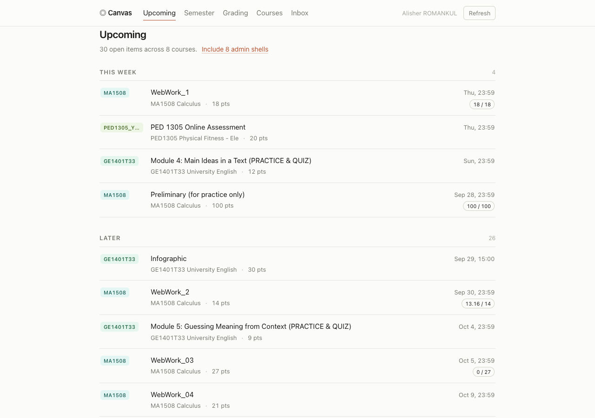
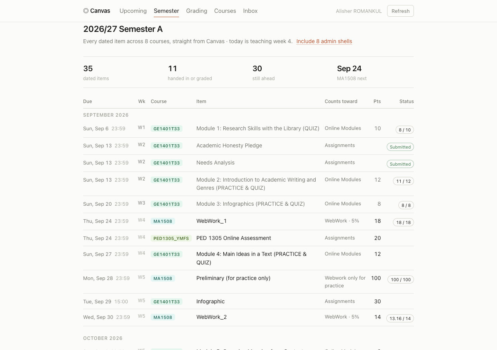
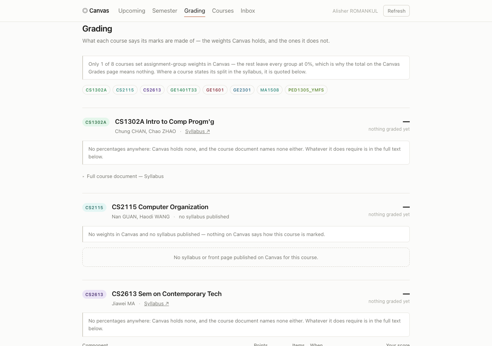
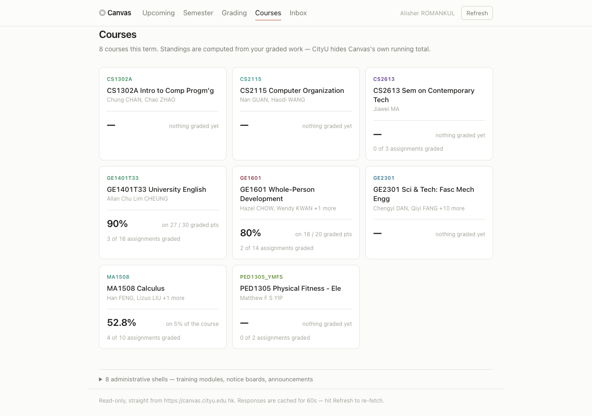
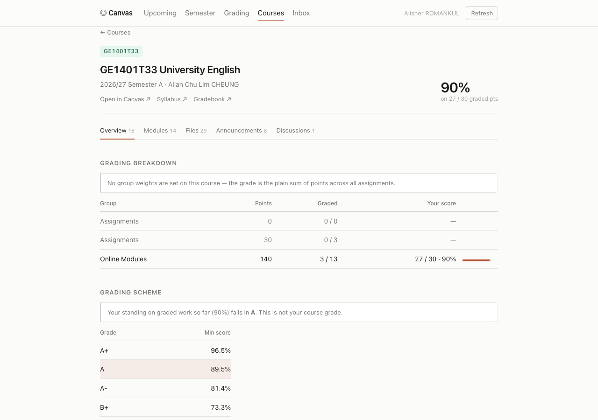
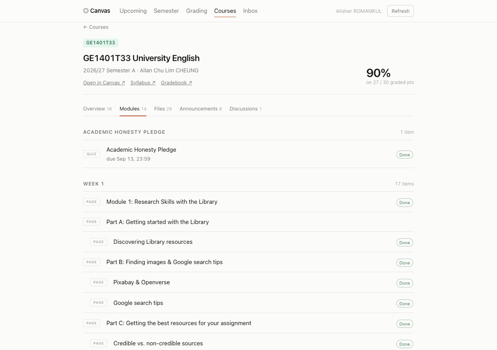
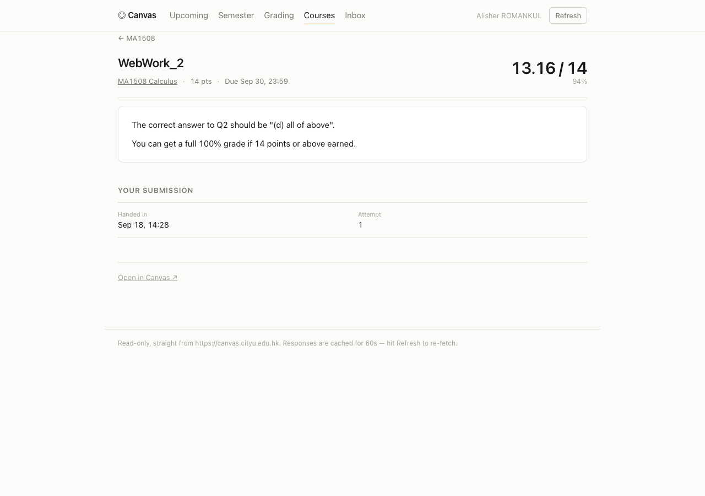
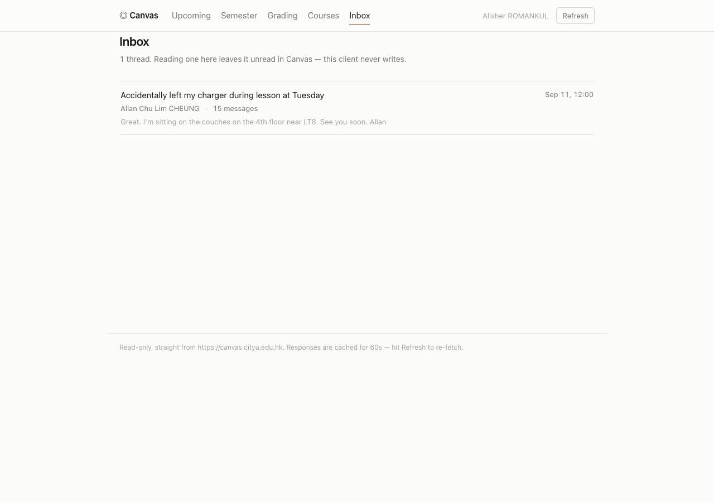

# Canvas Dashboard

A minimalist, read-only dashboard over the Canvas LMS API ([canvas.cityu.edu.hk](https://canvas.cityu.edu.hk)) — upcoming assignments, a full-semester schedule, per-course grading breakdowns, course materials and messages, all in one place, so opening Canvas itself becomes optional.

Zero dependencies, no build step, no data leaves the machine it runs on.

**Live demo:** https://mycanvas-app-tmpalish.azurewebsites.net (behind a login — see [Demo](#demo))

## Screenshots

**Upcoming** — every open assignment, bucketed into Overdue / Today / Tomorrow / This week / Later.



**Semester** — the whole term as one chronological table, with teaching weeks, points and status.



**Grading** — what each course's mark is actually made of, quoted from the syllabus where Canvas's own weights are 0%.



**Courses** — one card per course, with a standing computed from graded work.



**Course detail — Overview** — grading breakdown, letter-grade schemes, syllabus.



**Course detail — Modules** — the course's own structure, item by item, with completion.



**Assignment detail** — instructions, submission, score and feedback.



**Inbox** — full Canvas conversation threads.



## Architecture

```
Browser                    server.js (Node, zero deps)              Canvas LMS REST API
─────────                  ──────────────────────────               ───────────────────
public/*.js        ───►    serves static files              ───►    /api/v1/...
hash router                proxies /api/* to Canvas                 (Authorization: Bearer,
no build step               streams /file/:id                        added server-side —
                            in-memory 60s cache                       never sent to the browser)
                            4-way concurrency queue + retry
                            HTML sanitiser for Canvas content
                            optional HTTP Basic Auth
```

Canvas sends no CORS headers on `/api/v1`, so the browser can't call it directly. `server.js` is a thin, same-origin proxy that attaches the token server-side. The frontend is a router (`public/app.js`) matching `location.hash` against a route table and calling one `view*()` function per screen; each view fetches through `public/lib/api.js`, which owns caching, pagination and the derived course figures, and renders into a single shared `<main>`.

```
server.js            proxy + static files + auth, zero dependencies
public/
  index.html         shell: top bar, tabs, one <main>
  app.js             hash router
  lib/util.js        formatting, teaching weeks, HTML sanitising
  lib/api.js         proxy client, caches, derived course figures
  lib/ui.js          fragments every view shares
  views/*.js         one file per screen
```

Design decisions worth calling out:

- **Read-only, deliberately.** Every Canvas call is a `GET`. Taking a quiz, uploading a submission, replying to a discussion or answering a message still happens in Canvas; every screen that needs one of those links straight to the right page.
- **Token never reaches the browser.** It lives in `.env` locally, or a deployment's secret store (Azure App Settings) — either way it stays server-side.
- **Caching + concurrency control.** Canvas drops connections when a client opens a dozen requests at once, so requests are capped at 4 in flight with a 20s timeout and one retry; responses are cached in memory for 60s and *Refresh* bypasses it.
- **Sanitised HTML.** Everything Canvas renders — syllabi, pages, assignment text, discussion posts, messages — is stripped of `<script>`/`<iframe>`/event handlers before it reaches the DOM. Canvas file URLs are rewritten to the local `/file/:id` streaming route (so inline images and lecture PDFs actually load), and in-course links are rewritten to this app's own routes.

<details>
<summary>Canvas endpoints used (all read-only <code>GET</code>s)</summary>

| Data | Endpoint |
| --- | --- |
| Your name | `/users/self/profile` |
| Active courses | `/courses?enrollment_state=active&include[]=term&include[]=total_scores&include[]=teachers&include[]=syllabus_body` |
| Assignments, weights, submissions | `/courses/:id/assignment_groups?include[]=assignments&include[]=submission` |
| Course details + syllabus | `/courses/:id?include[]=syllabus_body` |
| Letter-grade schemes | `/courses/:id/grading_standards` |
| Course front page | `/courses/:id/front_page` |
| Modules and items | `/courses/:id/modules?include[]=items&include[]=content_details` |
| Files and folders | `/courses/:id/files`, `/courses/:id/folders` |
| A course page | `/courses/:id/pages/:slug` |
| Assignment + rubric | `/courses/:id/assignments/:aid?include[]=submission` |
| Submission + feedback | `/courses/:id/assignments/:aid/submissions/self?include[]=submission_comments&include[]=rubric_assessment` |
| Discussions | `/courses/:id/discussion_topics`, `/courses/:id/discussion_topics/:tid/view` |
| Messages | `/conversations`, `/conversations/:id?auto_mark_as_read=false` |
| File contents | `/files/:id`, then its signed `url` |
| Announcements | `/announcements?context_codes[]=course_:id&start_date=…&end_date=…` |

</details>

## Features

- **Upcoming** — every open assignment across your courses in one list, bucketed by urgency.
- **Semester** — every dated item in the term in one chronological table with its teaching week, what it counts toward, points and status, plus undated work, silent courses and recent announcements.
- **Grading** — the weights Canvas holds, and the percentages quoted verbatim from the syllabus where it holds none.
- **Courses** — one card per course with a computed standing and grading progress.
- **Course detail**, 5 tabs — Overview, Modules, Files, Announcements, Discussions.
- **Assignment detail** — full instructions, rubric with your marks, your submission, teacher comments.
- **Inbox** — whole Canvas conversation threads, read-only.
- Inline images and file attachments stream through the proxy and just work; internal links stay inside the app instead of bouncing out to Canvas.

## Tech stack

- **Backend** — Node.js built-ins only (`http`, `fs/promises`, `crypto`, `stream`), zero npm dependencies
- **Frontend** — vanilla JavaScript ES modules, no framework, no bundler, no build step
- **Styling** — plain CSS, `prefers-color-scheme` theming, mobile-responsive layout
- **Container** — Docker (`node:20-alpine`)
- **Registry** — Docker Hub
- **Hosting** — Azure App Service for Containers (Azure for Students)
- **Auth** — HTTP Basic Auth with constant-time credential comparison, for the public deployment

## My contribution

Solo, end-to-end build:

- Designed and built the proxy server from scratch — pagination-following, the in-memory cache, and the concurrency queue that works around Canvas silently dropping connections under load.
- Built the entire frontend: hash router, 9 view modules, shared UI fragments — no framework, no build tooling.
- Wrote the HTML sanitiser that makes Canvas-authored content (syllabi, pages, discussions, messages) safe to render, plus the link/file rewriting that keeps navigation inside the app.
- Worked around several quirks specific to CityU's Canvas instance — hidden final grades, administrative "course" shells mixed in with real courses, assignment groups left at 0% weight almost everywhere, duplicated grading standards — instead of surfacing Canvas's raw, misleading numbers.
- Containerized the app and set up the deployment pipeline: GitHub → Docker Hub → Azure App Service.
- Added HTTP Basic Auth after recognizing the original security model (bind to `127.0.0.1` only) didn't hold once the app was reachable from the public internet.

## Demo

Live at **https://mycanvas-app-tmpalish.azurewebsites.net**.

The dashboard reads personal grades, submissions and private messages, so the public deployment sits behind HTTP Basic Auth — credentials aren't published in this README. Run it yourself locally instead (see [Deployment](#deployment)) if you want to try it against your own Canvas account.

## Deployment

**Locally**

```bash
cp .env.example .env      # paste your Canvas token into CANVAS_TOKEN=
node server.js
```

Open <http://localhost:5173>.

**In Docker**

```bash
docker build -t mycanvas .
docker run -p 5173:5173 --env-file .env mycanvas
```

**Deployed stack**

| Stage | Where |
| --- | --- |
| Source | GitHub — [Alishnis/MyCanvas](https://github.com/Alishnis/MyCanvas) |
| Image | Docker Hub — `tmpalish/mycanvas:latest` (built for `linux/amd64`) |
| Hosting | Azure App Service for Containers, `mycanvas-rg` resource group |
| Secrets | Canvas token + Basic Auth credentials set as Azure App Settings — never baked into the image or committed to git |

Redeploy after a change:

```bash
docker buildx build --platform linux/amd64 --provenance=false -t tmpalish/mycanvas:latest --push .
az webapp restart -g mycanvas-rg -n mycanvas-app-tmpalish
```

## Results

- One dashboard replaces four-plus separate Canvas pages (assignments, grades, modules, inbox) — tested against a real account: 8 active courses, 30+ open assignments tracked at once.
- Recovers the actual grading breakdown for courses where Canvas's own total is 0% and meaningless (true for 7 of the 8 courses on this account) by quoting the syllabus instead of showing an empty number.
- Zero runtime dependencies keep the Docker image small (~90 MB compressed) and the attack surface minimal.
- Runs both fully local (bound to `127.0.0.1`, nothing else on the network can reach it) and as a public container behind Basic Auth, from the same unmodified codebase.

## Notes

- Teaching weeks are anchored by hand in `public/lib/util.js` (`WEEK1_MONDAY`) — Canvas only exposes the term's administrative start, three weeks before classes actually begin.
- Anything scheduled outside Canvas — a Moodle quiz, an exam timetable, a date announced only in a lecture — is invisible here; the Semester view says so.
- Revoke access anytime at <https://canvas.cityu.edu.hk/profile/settings> — it stops the token working immediately.
